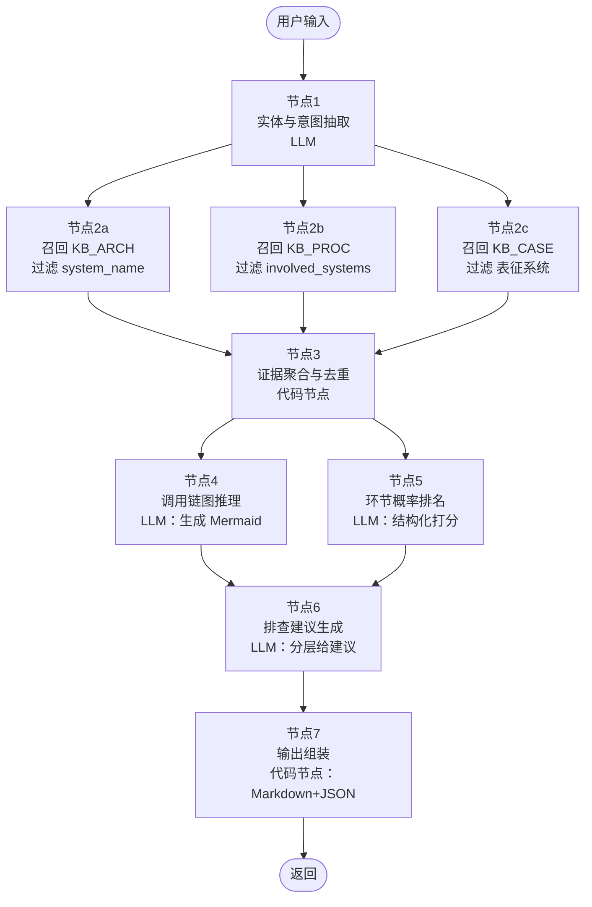
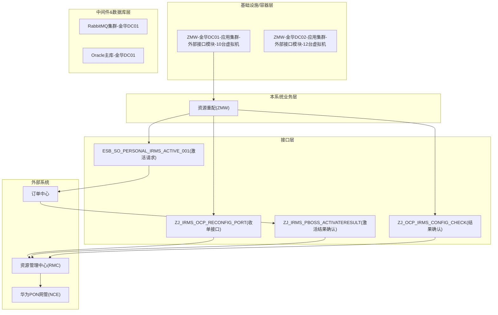

# 扣子（Coze）故障排查工作流 —— 总体设计 v1.0

> 输入：`表征系统名` + `故障现象 / 业务场景描述`
> 输出：一张**只使用知识库专有术语**的排查流程图（Mermaid） + 每个环节的**故障概率排名**与**排查建议**（含 KB 中已有的命令 / SQL / 责任方）
> 适用：多系统、多流程、跨公司内部系统与外部系统的联动排障，支持后续接入实时接口 / 日志数据。
> 知识库范围：`系统架构知识库`、`业务流程知识库`、`历史故障案例知识库` 三份（均已元数据化分段）。

---

## 0. 对你原始想法的评审

| 你的想法 | 评审结论 | 说明 / 纠正 |
| --- | --- | --- |
| 输入 `表征系统 + 故障现象/业务场景` | ✅ 正确 | 这是最自然的入口。但仅这两个字段在 RAG 召回时不够精准，需要在工作流里再跑一次**实体/意图抽取**，把"现象"标准化成关键词 + 功能菜单 + 业务环节。 |
| 先看系统容器/DB/中间件指标，再看业务，再看对外调用 | ✅ 正确 | 这是运维的黄金顺序。我们把它固化为"**纵向分层（基础设施→中间件→DB→业务→接口→外部系统）** + **横向调用链（图推理）**"两维结构。 |
| 要有从宏观到微观、图数据库式的空间思维 | ✅ 正确，要强化 | 单次 LLM 难以同时"画图 + 推概率 + 写建议"，容易含糊。设计上**拆成多个节点**，让模型分步推理（类似 CoT + ReAct），最后统一组装。 |
| 输出排查流程图 + 概率排名 + 排查意见 | ✅ 正确 | 再加两样：**相似历史故障案例 Top-N**（这是你现有知识库里最值钱的资产，不用白不用），以及**结构化 JSON**（便于以后接接口/日志后二次编排）。 |
| 术语必须出自知识库，不能编造 | ✅ 关键 | 这条必须在 Prompt 里做成**硬约束**："凡不在召回片段中出现的系统名/功能菜单/接口名/容器名，一律以 `[知识库未覆盖]` 占位"。 |
| 目前没有接口/日志的实时数据 | ✅ 明确 | 本版工作流完全基于 KB，**只给"建议查什么"**，不给"实时判定"。后续节点预留 `tool_call` 插槽（见第 7 节路线图）。 |
| 单一 LLM 一把梭回答 | ⚠ 需纠正 | 建议改成**多节点流水线 + 并行召回**。单 LLM 一把梭在跨系统场景下会"术语漂移"和"概率拍脑袋"。 |
| 只靠语义召回 | ⚠ 需纠正 | 必须**元数据过滤 + 语义检索**双路：表征系统名走元数据精确过滤，现象描述走语义检索。否则召回会把无关系统的切片混进来。 |

一句话结论：**你的思路方向 90% 正确，主要补强两点——(1) 把"一个大 Prompt"拆成流水线节点；(2) 把"系统名、业务流程ID、故障关键词"提升为一等元数据，用于硬过滤召回。**

---

## 1. 知识库在扣子里的切片与元数据规范

三份 MD 已经做了 `---分段---` 切分，并在每段头部写了元数据块（` # 元数据 ... ` 代码块）。为了让 Coze 的知识库能"按字段过滤召回"，在建库时要把元数据提升为**结构化字段**（Coze 知识库支持在切片上挂元数据）。

### 1.1 知识库 A：`KB_ARCH` 系统架构
- 切片粒度：**每 `系统名 × 架构类型` 一片**（部署 / 技术 / 功能，各一片）。
- 切片必带元数据字段：
  - `system_name`（枚举：资源管理中心(RMC)、装维服务调度系统(ZMW)、…）
  - `arch_type`（`部署架构` / `技术架构` / `功能架构`）
  - `components`（数组：`Oracle`、`Redis`、`Kafka`、`BWS`、`RabbitMQ`、…）
  - `functions`（数组：`家客装机`、`资源重配`、`工单报结`、…，仅功能架构切片有）
  - `keywords`（数组）
- 主要用途：
  - 给出**本系统**的容器/中间件/数据库清单（纵向排查"指标正不正常"的对象）；
  - 给出**功能菜单术语**，用于流程图节点命名。

### 1.2 知识库 B：`KB_PROC` 业务流程
- 切片粒度：**每业务流程 1 片**（含 mermaid 调用链 + 异常对照表），对照表行数多时可再按"流程环节"拆子片，但保留 `proc_id`。
- 必带元数据：
  - `proc_id`（`PROC-001`、`PROC-002`、…）
  - `proc_name`
  - `involved_systems`（数组）
  - `abnormal_phases`（数组：`容器层`、`数据库层`、`接口调用层`、`订单延迟` 等）
  - `interfaces`（数组，若有：`ZJ_IRMS_OCP_RECONFIG_PORT`、`ESB_SO_PERSONAL_IRMS_ACTIVE_001`、…）
  - `keywords`
- 主要用途：
  - 给出**横向调用链**（a→b→c→d 线性 / 扇出 / 回调）；
  - 给出**每环节的排查步骤、SQL、责任方**（对照表直接喂给 LLM 复用）。

### 1.3 知识库 C：`KB_CASE` 历史故障案例
- 切片粒度：**一案例一片**（你当前格式已经是这样）。
- 必带元数据：
  - `fault_id`
  - `表征系统` / `根因系统` / `根因分类`
  - `关联业务流程`（`PROC-00x`）
  - `涉及系统`（数组）
  - `标签`（数组）
  - `关键词`（数组，来自"故障现象（关键词化）"段）
  - `发生时间` / `解决时长`
- 主要用途：
  - **最高价值的经验资产**：基于"表征系统 + 现象关键词"召回相似案例，作为概率先验。
  - 输出里提供"Top-N 相似案例"，工程师一眼能对比。

> 建库建议：在 Coze 里建 **3 个独立知识库**（而不是合成一个），召回时分别 TopK 并在工作流里做聚合——这样更好控制权重和噪声。

---

## 2. 工作流总体拓扑



设计要点：
- **节点 2a/2b/2c 并行**，分别走三个知识库，互不污染。
- **节点 4（画图）与节点 5（排概率）同层**，输入都是聚合后的证据集，互不依赖，降低误差传播。
- **节点 6** 同时消费节点 4 的流程图节点清单和节点 5 的概率排名，产出最终建议。
- **节点 7** 输出同时给"人看的 Markdown"和"机器看的 JSON"，为后续接入实时接口/日志打底（见 §7）。

---

## 3. 工作流输入 / 输出契约

### 3.1 入参
```json
{
  "symptom_system": "装维服务调度系统",
  "symptom_desc": "嘉兴地区家客资源重配工单大面积积压，改端口失败率高",
  "occur_time": "2026-04-20 10:30",           // 可选
  "scope": "嘉兴地区"                            // 可选
}
```

### 3.2 出参（节点 7 产出）
```json
{
  "normalized": {
    "symptom_system_std": "装维服务调度系统(ZMW)",
    "candidate_procs": ["PROC-002"],
    "candidate_functions": ["资源重配", "户线配置"],
    "extracted_keywords": ["资源重配积压", "改端口失败", "嘉兴"]
  },
  "similar_cases": [
    {"fault_id": "GZ-20260316-001", "root_system": "华为PON网管", "similarity": "高", "why": "..." },
    {"fault_id": "GZ-20260318-001", "root_system": "华为PON网管", "similarity": "高", "why": "..." }
  ],
  "triage_graph_mermaid": "flowchart TB ...",
  "ranked_suspects": [
    {"rank": 1, "node": "华为PON网管(NCE)-北向接口", "probability": "高", "reason": "..."},
    {"rank": 2, "node": "ZMW-外部接口模块(金华DC01)", "probability": "中", "reason": "..."},
    ...
  ],
  "investigation_plan": [
    {
      "layer": "基础设施/容器层",
      "targets": [
        {"system": "装维服务调度系统(ZMW)", "object": "金华DC01-应用集群-10台虚拟机-外部接口模块",
         "check_items": ["Pod就绪率", "容器重启次数", "CPU/内存使用率"],
         "commands": ["kubectl get pods -l app=...", "kubectl top pods ..."],
         "source": ["KB_ARCH#ZMW部署架构", "KB_PROC#PROC-002容器层排查"],
         "responsible": "资源中心容器运维"}
      ]
    },
    { "layer": "数据处理层-数据库", ... },
    { "layer": "业务层", ... },
    { "layer": "接口调用层（本系统出站）", ... },
    { "layer": "外部系统", ... }
  ],
  "uncovered": ["用户提到的 XX 功能在当前知识库中未找到对应术语"]
}
```

---

## 4. 各节点详细设计

### 节点 1：实体与意图抽取（LLM）

目的：把自由文本的"现象描述"规范化成枚举字段，用于后续精确召回。

**系统提示词（关键片段）**：
```
你是故障排查前置分析助手。只允许使用下列知识库中已存在的术语集合：
- 已知系统名：{{from KB_ARCH.system_name 枚举}}
- 已知业务流程ID / 名称：{{from KB_PROC}}
- 已知功能菜单术语：{{from KB_ARCH 功能架构}}

请根据用户输入，输出严格 JSON：
{
  "symptom_system_std": <必须命中已知系统名，否则填 UNKNOWN>,
  "candidate_procs": [<可能涉及的 PROC-ID，可多个>],
  "candidate_functions": [<可能涉及的功能菜单术语，可多个>],
  "extracted_keywords": [<3~8 个关键词，用于语义召回>]
}
不要编造术语；若用户描述无法匹配，用 UNKNOWN 占位并在 extracted_keywords 中保留原文片段。
```

> 实现技巧：把"已知系统名/流程ID/功能术语"在 workflow 启动时从 KB 生成一份小字典，作为**变量**注入（或直接硬编码在 prompt 里，每次知识库更新时同步）。

### 节点 2a / 2b / 2c：三路并行召回

| 节点 | 知识库 | 元数据硬过滤 | 语义 Query | TopK |
| --- | --- | --- | --- | --- |
| 2a | KB_ARCH | `system_name == symptom_system_std` | `symptom_desc + extracted_keywords` | 3（通常就是该系统的部署/技术/功能三片） |
| 2b | KB_PROC | `involved_systems contains symptom_system_std` | `symptom_desc + candidate_functions` | 3 |
| 2c | KB_CASE | `表征系统 contains symptom_system_std` | `extracted_keywords + symptom_desc` | 5 |

> 若 2a/2b/2c 任一路命中为 0：放宽过滤（仅语义召回）再跑一次，并把"知识库未直接覆盖该系统"记入 `uncovered`。

### 节点 3：证据聚合与去重（代码节点 / JS）

职责：
- 把三路召回的切片按 `doc_type + id` 去重；
- 组装成 LLM 易消费的结构：
  ```json
  {
    "arch": [ { "system": "...", "arch_type": "...", "content": "..." } ],
    "procs": [ { "proc_id": "...", "involved_systems": [...], "content": "...(含流程图 mermaid + 异常对照表)" } ],
    "cases": [ { "fault_id": "...", "表征系统": "...", "根因系统": "...", "根因分类": "...", "标签": [...], "content": "..." } ]
  }
  ```
- 生成**术语白名单**（从三路切片里抽出的所有系统名、功能名、接口名、容器/中间件名、机房名），供节点 4/5/6 硬约束使用。

### 节点 4：调用链图推理（LLM，输出 Mermaid）

**核心硬约束**：只能使用 `术语白名单` 里出现过的名字。

**系统提示词（关键片段）**：
```
你是资深多系统排障架构师。请基于提供的 [arch/procs/cases] 证据，为用户描述的故障构造
一张"排查调用链流程图"（Mermaid flowchart TB）。要求：

1. 先从表征系统本身开始（容器层/中间件层/数据库层 → 业务层 → 接口层）；
2. 再扩展到该系统调用的下游系统、以及这些下游系统可能的回调或再调用（线性或扇出都要体现）；
3. 节点命名**必须**来自【术语白名单】，格式示例：
   - 系统: "装维服务调度系统(ZMW)"
   - 容器: "ZMW-金华DC01-外部接口模块-10台虚拟机"
   - 中间件: "RabbitMQ集群-金华DC01"
   - 数据库: "Oracle主库-金华DC01"
   - 接口: "ZJ_IRMS_OCP_RECONFIG_PORT(收单接口)"
   - 外部系统: "华为PON网管(NCE)"
4. 必须分 subgraph 清晰分层：基础设施层 / 中间件&数据库层 / 业务层 / 接口层 / 外部系统；
5. 若证据无法支持某条边，不要画；宁缺毋滥；
6. 不要解释，仅返回 Mermaid 代码块。
```

同时输出**节点清单 JSON**（供节点 5/6 消费）：
```json
{ "graph_nodes": [ {"id": "N1", "name": "...", "layer": "容器层"}, ... ],
  "graph_edges": [ {"from": "N1", "to": "N2", "label": "调用"}, ... ] }
```

### 节点 5：环节概率排名（LLM，结构化输出）

输入：`graph_nodes` + `cases`（历史案例是概率先验的主要来源）+ `procs`（异常高发环节字段）。

**系统提示词（关键片段）**：
```
你是故障根因先验模型。请对【节点清单】里的每个节点，估计"在本次故障中是问题源"的概率，
并按概率从高到低排序。估计依据（权重递减）：
  (a) KB_CASE 中与本次现象关键词/表征系统匹配的历史案例的【根因系统 / 根因分类 / 关联业务流程】分布；
  (b) KB_PROC 中该流程的【异常高发环节】字段；
  (c) KB_ARCH 中该组件的【常见故障点】字段。
输出严格 JSON：
[
  {"rank": 1, "node": "<白名单术语>", "probability": "高/中/低",
   "evidence_case_ids": ["GZ-..."], "reason": "<1~2 句话，引用具体字段>"},
  ...
]
不要编造案例 ID；若证据不足请标 "probability": "未知" 并说明缺口。
```

### 节点 6：排查建议生成（LLM，分层给建议）

**系统提示词（关键片段）**：
```
你现在是一线运维工程师的"排障陪跑"。请按下列固定层级顺序，对每一层给出可执行的排查动作。
层级顺序（不得改变）：
  1) 基础设施 / 容器层（Pod/虚机/物理机）
  2) 中间件层（MQ/Redis/Nginx/Tomcat/BWS/ArcGIS/Activiti/...）
  3) 数据库层（Oracle/MySQL/Neo4j/...）
  4) 本系统业务层（功能菜单 / 指标）
  5) 本系统出站接口层（逐接口排查）
  6) 下游/外部系统（含其再调用）

每一层输出：
  - 对象：必须是【术语白名单】里的名字
  - 检查项：优先抄录 KB_ARCH.核心监控指标 / KB_PROC.异常对照表.具体排查步骤
  - 命令/SQL：如 KB_PROC 对照表里给了，必须原样引用（保留接口名/表名）；没给就留空，不要编
  - 责任方：抄录 KB_PROC 对照表或 KB_CASE.处理部门
  - 证据来源：写明切片 ID（如 KB_PROC#PROC-002#接口1）

若某层在知识库中无证据，写 "证据不足，建议人工补充"，不要编造。
最终以 JSON 数组返回，字段见输出契约 investigation_plan。
```

### 节点 7：输出组装（代码节点）

- 把节点 1/3/4/5/6 的产物拼成 §3.2 的最终 JSON；
- 同时渲染一份 Markdown 报告：
  - 一级标题：`# 故障排查建议`
  - `## 1. 输入标准化 & 相似历史案例`
  - `## 2. 排查调用链（Mermaid）`
  - `## 3. 嫌疑环节概率排名`
  - `## 4. 分层排查计划`
  - `## 5. 知识库未覆盖项`

---

## 5. 端到端示例（用你 KB 里现成的"嘉兴资源重配积压"场景走一遍）

**入参**：
```json
{"symptom_system": "装维服务调度系统",
 "symptom_desc": "嘉兴地区家客资源重配工单积压，改端口失败率高"}
```

**节点 1 输出（期望）**：
```json
{"symptom_system_std": "装维服务调度系统(ZMW)",
 "candidate_procs": ["PROC-002"],
 "candidate_functions": ["家客资源同步", "家客户线配置", "资源重配"],
 "extracted_keywords": ["资源重配积压","改端口失败","嘉兴","在途更资源积压劣化"]}
```

**节点 2c 召回**（期望命中）：`GZ-20260316-001`、`GZ-20260318-001`（两例 PON 主备切换）。

**节点 4 输出（流程图，节选）**：


**节点 5 输出（概率排名）**：
```
1. 华为PON网管(NCE)-北向接口  概率=高  证据=GZ-20260316-001/GZ-20260318-001（主备切换）
2. ZJ_IRMS_OCP_RECONFIG_PORT  概率=中  证据=PROC-002 异常高发环节
3. Oracle主库-金华DC01         概率=中  证据=GZ-20260130-001（行锁争用）
4. ZMW-外部接口模块容器        概率=低  证据=PROC-002 容器层排查优先项
```

**节点 6 输出（分层建议，节选）**：
- 基础设施/容器层：检查 `kubectl get pods -l app=irm-backend-ifc-family`（抄自 PROC-002）。
- 数据库层：`SELECT * FROM v$lock WHERE block=1;`（抄自 PROC-002）。
- 接口层（逐接口）：抄 PROC-002 对照表里每个接口的 SQL 原文，不改写。
- 外部系统：提示"参考 GZ-20260316-001：查 NCE 主备状态与石桥机房上联交换机端口"。

---

## 6. 不能编造 / 术语一致性的"硬约束"实现

在节点 4、5、6 的 Prompt 里统一加入以下段落（这是整个工作流的底线）：

```
【硬约束】
1. 节点名/系统名/中间件/数据库/机房/功能菜单/接口名，必须 100% 来自我提供的【术语白名单】。
2. 若白名单中找不到可表达的术语，请使用占位符 [知识库未覆盖:<原始现象片段>]，不要近义替换。
3. 不要输出任何未经 KB 证据支持的命令、SQL、IP、接口名。
4. 每条结论尽量携带 source: <切片ID>，无来源不写。
```

并在节点 7 做一次**后置校验**（代码节点）：遍历生成的 mermaid / JSON，把不在白名单里的名字高亮到 `uncovered`，方便迭代补 KB。

---

## 7. 迭代路线图（V1→V3）

### V1（本版，纯 KB 推理）
- 上述 7 节点，无外部工具调用；
- 输出"该查什么、查哪里、找谁"；
- 人工判读 + 手动执行命令。

### V2（接入只读指标 / 日志）
在节点 6 之后插入 `tool_call` 节点（Coze 的 HTTP 插件/工具）：
- 查容器：调用 K8s 只读 API 拿 Pod 状态；
- 查 DB：调用封装好的只读 SQL 服务；
- 查接口成功率：调用接口日志平台 REST。
- 把真实数据塞回上下文，让节点 6 从"建议"升级为"初判"。

### V3（记忆 & 自学习）
- 每次用户反馈"根因实际是哪个系统/环节"，回写为新的 `KB_CASE` 切片（带 `fault_id`、`表征系统`、`根因系统`）；
- 自动扩充"已知系统/接口/功能"词表；
- 概率先验从启发式升级为**基于历史频次的贝叶斯先验**（代码节点里直接算，无需 LLM）。

### V4（图数据库化）
- 把 `KB_ARCH + KB_PROC` 抽成 Neo4j：节点=系统/组件/接口，边=调用/部署关系；
- 节点 4 改为"图查询 + LLM 复述"，流程图由 Cypher 生成，彻底杜绝幻觉。

---

## 8. 落地步骤清单（在扣子里怎么一步步建）

1. **建 3 个知识库**：`KB_ARCH` / `KB_PROC` / `KB_CASE`，分别上传对应 MD，按 `---分段---` 切片；在切片元数据里补 §1 中列出的字段（Coze 支持 JSON 元数据）。
2. **建工作流**：按 §2 拓扑新建 7 个节点。
3. **维护术语字典**：在工作流开始前加一个 `变量` 节点，存放"已知系统名/流程ID/功能术语"数组（来自 KB_ARCH/KB_PROC 的元数据 distinct）。每次 KB 更新后重新生成一次即可。
4. **Prompt 配置**：按 §4 的片段配置各 LLM 节点；温度建议 0.2，节点 4/5 最大 tokens ≥ 1500。
5. **联调用例**：先用 §5 的"嘉兴资源重配积压"跑通；再造 2 个反例（如"测速失败 / 集客APP"、"EOMS 主从同步延迟"）验证术语是否都来自 KB。
6. **把未命中记入 `uncovered`**，反向驱动 KB 补写，形成闭环。

---

## 9. 附：Prompt 片段速查表

| 节点 | 温度 | 输出格式 | 关键硬约束 |
| --- | --- | --- | --- |
| 1 实体抽取 | 0.1 | JSON | 不编造系统名/流程ID |
| 4 画图 | 0.2 | Mermaid | 只用术语白名单 |
| 5 概率 | 0.2 | JSON 数组 | 必须带 evidence_case_ids |
| 6 建议 | 0.3 | JSON 数组 | 命令/SQL 原样引用，责任方来自 KB |

---

> 文档版本：v1.0 / 2026-04-21
> 配套文件：`docs/coze-workflow/prompts/` 下存放各节点完整 Prompt 模板（见仓库）。

