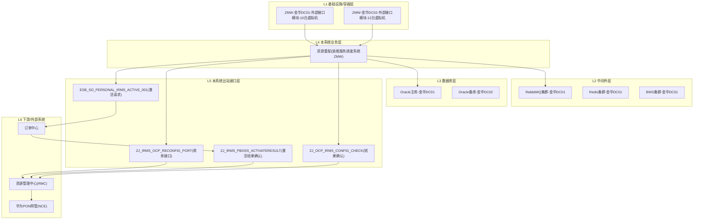

# 端到端样例：嘉兴资源重配积压（验收样本）

> 本样例用 KB 中现有的 `PROC-002` + `GZ-20260316-001` + `GZ-20260318-001` + `GZ-20260130-001` 现成证据走完一遍，
> 用于在扣子里配完工作流后对齐输出格式与术语一致性。

---

## 输入

```json
{
  "symptom_system": "装维服务调度系统",
  "symptom_desc": "嘉兴地区家客资源重配工单大面积积压，改端口失败率高",
  "occur_time": "2026-04-21 10:30",
  "scope": "嘉兴"
}
```

## 节点 1（实体抽取）期望输出

```json
{
  "symptom_system_std": "装维服务调度系统(ZMW)",
  "candidate_procs": ["PROC-002"],
  "candidate_functions": ["资源重配", "家客户线配置"],
  "extracted_keywords": ["资源重配积压", "改端口失败", "在途更资源积压劣化", "嘉兴"],
  "confidence": "高",
  "notes": "匹配 PROC-002 家客资源重配异常定位定界流程"
}
```

## 节点 2a/2b/2c 召回期望

- 2a（KB_ARCH）：
  - `装维服务调度系统(ZMW)-部署架构`
  - `装维服务调度系统(ZMW)-技术架构`
  - `装维服务调度系统(ZMW)-功能架构`
  - 额外召回：`资源管理中心(RMC)-部署架构`（因为 PROC-002 涉及 RMC）
- 2b（KB_PROC）：
  - `PROC-002 家客资源重配异常定位定界流程`（命中元数据 + 语义）
- 2c（KB_CASE）Top-5：
  - `GZ-20260316-001` 华为PON北向接口异常（3月16）
  - `GZ-20260318-001` 华为PON北向接口异常（3月18）
  - `GZ-20260130-001` 资源管理中心数据库行锁争用
  - 其余命中为弱相关，剔除或记为低权重

## 节点 3（聚合）输出样例（节选）

```json
{
  "evidence": {
    "arch": [
      {"system": "装维服务调度系统(ZMW)", "arch_type": "部署架构", "slice_id": "KB_ARCH#ZMW#部署架构", "components": ["BWS","Tomcat","Redis","RabbitMQ","Oracle","MySQL"]},
      {"system": "装维服务调度系统(ZMW)", "arch_type": "技术架构", "slice_id": "KB_ARCH#ZMW#技术架构"},
      {"system": "资源管理中心(RMC)", "arch_type": "部署架构", "slice_id": "KB_ARCH#RMC#部署架构"}
    ],
    "procs": [
      {"proc_id": "PROC-002", "proc_name": "家客资源重配异常定位定界",
       "involved_systems": ["装维服务调度系统","资源管理中心(RMC)","订单中心","华为PON网管"],
       "abnormal_phases": ["容器层","数据库层","接口调用层","订单延迟"],
       "interfaces": ["ZJ_IRMS_OCP_RECONFIG_PORT","ESB_SO_PERSONAL_IRMS_ACTIVE_001","ZJ_IRMS_PBOSS_ACTIVATERESULT","ZJ_OCP_IRMS_CONFIG_CHECK"]}
    ],
    "cases": [
      {"fault_id": "GZ-20260316-001", "表征系统": "装维服务调度系统", "根因系统": "华为PON网管", "根因分类": "主备切换", "关联业务流程": "PROC-002"},
      {"fault_id": "GZ-20260318-001", "表征系统": "装维服务调度系统", "根因系统": "华为PON网管", "根因分类": "主备切换", "关联业务流程": "PROC-002"},
      {"fault_id": "GZ-20260130-001", "表征系统": "资源管理中心", "根因系统": "主数据平台", "根因分类": "流量风暴", "关联业务流程": "PROC-002"}
    ]
  },
  "terms_whitelist": [
    "装维服务调度系统(ZMW)", "资源管理中心(RMC)", "订单中心", "华为PON网管(NCE)", "RMS终端管理系统",
    "BWS集群-金华DC01", "Tomcat集群-金华DC01", "RabbitMQ集群-金华DC01", "Redis集群-金华DC01",
    "Oracle主库-金华DC01", "Oracle备库-金华DC02",
    "ZMW-金华DC01-外部接口模块-10台虚拟机", "ZMW-金华DC02-外部接口模块-12台虚拟机",
    "ZJ_IRMS_OCP_RECONFIG_PORT", "ESB_SO_PERSONAL_IRMS_ACTIVE_001",
    "ZJ_IRMS_PBOSS_ACTIVATERESULT", "ZJ_OCP_IRMS_CONFIG_CHECK",
    "资源重配", "家客户线配置",
    "irm.irmsng_integrationlog"
  ]
}
```

## 节点 4（调用链图）期望输出



## 节点 5（概率排名）期望输出

```json
[
  {"rank": 1, "node": "华为PON网管(NCE)", "probability": "高",
   "evidence_case_ids": ["GZ-20260316-001","GZ-20260318-001"],
   "evidence_arch_points": [], "evidence_proc_phases": ["接口调用层"],
   "reason": "两例历史案例根因系统=华为PON网管且表征系统=装维服务调度系统；现象都是资源重配积压/改端口失败，与本次高度吻合。"},

  {"rank": 2, "node": "ZJ_IRMS_OCP_RECONFIG_PORT(收单接口)", "probability": "中",
   "evidence_case_ids": [], "evidence_arch_points": [], "evidence_proc_phases": ["接口调用层"],
   "reason": "PROC-002 把该接口列为资源重配首个接口排查项，成功率<90% 即可定界资源中心侧。"},

  {"rank": 3, "node": "Oracle主库-金华DC01", "probability": "中",
   "evidence_case_ids": ["GZ-20260130-001"], "evidence_arch_points": ["行锁争用","CPU使用率高","IO等待"],
   "evidence_proc_phases": ["数据库层"],
   "reason": "存在主数据批量同步引起 Oracle 行锁争用的历史先例，需排除。"},

  {"rank": 4, "node": "ZMW-金华DC01-外部接口模块-10台虚拟机", "probability": "低",
   "evidence_case_ids": [], "evidence_arch_points": ["接口超时","服务不可用","数据库连接池耗尽"],
   "evidence_proc_phases": ["容器层"],
   "reason": "按 PROC-002 排查顺序为首站，但当前证据更指向外部系统，标低。"},

  {"rank": 5, "node": "ZJ_OCP_IRMS_CONFIG_CHECK(结果确认)", "probability": "低",
   "evidence_case_ids": [], "evidence_arch_points": [], "evidence_proc_phases": ["接口调用层"],
   "reason": "PROC-002 末端接口，若前序接口都 ≥90% 成功率，再查该接口。"}
]
```

## 节点 6（分层建议）期望输出（节选）

```json
[
  {
    "layer": "L1 基础设施/容器层",
    "actions": [
      {
        "object": "ZMW-金华DC01-外部接口模块-10台虚拟机",
        "check_items": ["Pod就绪率", "容器重启次数", "CPU/内存使用率", "POD节点状态≠0", "CPU使用率≤100%"],
        "commands": [
          "kubectl get pods -l app=irm-backend-ifc-family",
          "kubectl top pods -l app=irm-backend-ifc-family"
        ],
        "responsible": "资源中心容器运维",
        "source": ["KB_PROC#PROC-002#容器层排查", "KB_ARCH#ZMW#技术架构"],
        "priority_hint": "低",
        "note": ""
      }
    ]
  },
  {
    "layer": "L3 数据库层",
    "actions": [
      {
        "object": "Oracle主库-金华DC01",
        "check_items": ["连通性", "库夯住", "表锁", "CPU", "IO等待", "慢查询"],
        "commands": [
          "tnsping 188.104.14.15:1521_WG_ZC_ZYZX_zjjh-jh3f-zhzg01",
          "SELECT * FROM v$lock WHERE block=1"
        ],
        "responsible": "资源中心数据库运维",
        "source": ["KB_PROC#PROC-002#数据库层排查", "KB_CASE#GZ-20260130-001"],
        "priority_hint": "中",
        "note": "历史有主数据批量同步引发行锁的案例，若命中可联系数据库组查杀"
      }
    ]
  },
  {
    "layer": "L5 本系统出站接口层",
    "actions": [
      {
        "object": "ZJ_IRMS_OCP_RECONFIG_PORT(收单接口)",
        "check_items": ["成功率是否≥90%", "近5分钟异常TOP10日志", "按订单号查请求/响应"],
        "commands": [
          "select t.id 接口日志ID, t.starttime 请求时间, t.endtime 结束时间, t.requestmessage 请求内容, t.responsemessage 响应内容, t.errormessage 错误内容 from irm.irmsng_integrationlog t WHERE t.servicename = 'ZJ_IRMS_OCP_RECONFIG_PORT' and t.starttime >= sysdate - interval '5' minute and rownum <= 10 order by t.starttime desc"
        ],
        "responsible": "资源中心侧",
        "source": ["KB_PROC#PROC-002#接口1"],
        "priority_hint": "中",
        "note": ""
      },
      {
        "object": "ESB_SO_PERSONAL_IRMS_ACTIVE_001(激活请求)",
        "check_items": ["成功率是否≥90%", "近5分钟异常TOP10日志", "联系订单中心确认服务状态"],
        "commands": ["select ... where t.servicename = 'ESB_SO_PERSONAL_IRMS_ACTIVE_001' ..."],
        "responsible": "订单中心侧",
        "source": ["KB_PROC#PROC-002#接口2"],
        "priority_hint": "中",
        "note": ""
      }
    ]
  },
  {
    "layer": "L6 下游/外部系统",
    "actions": [
      {
        "object": "华为PON网管(NCE)",
        "check_items": ["主备机状态", "主备心跳网络是否通", "上联交换机端口是否被误关闭"],
        "commands": [],
        "responsible": "网管资源部 / 互联网部",
        "source": ["KB_CASE#GZ-20260316-001", "KB_CASE#GZ-20260318-001"],
        "priority_hint": "高",
        "note": "参考两例历史案例：石桥/萧山机房上联交换机端口被误关闭触发主备切换"
      }
    ]
  }
]
```

## 节点 7（最终 Markdown 报告）效果示意

```markdown
# 故障排查建议

## 1. 输入标准化 & 相似历史案例
- 表征系统：装维服务调度系统(ZMW)
- 候选业务流程：PROC-002
- 候选功能：资源重配, 家客户线配置
- 关键词：资源重配积压, 改端口失败, 在途更资源积压劣化, 嘉兴

**相似历史案例 Top-3：**
- `GZ-20260316-001` 表征=装维服务调度系统 / 根因=华为PON网管（主备切换） / 流程=PROC-002
- `GZ-20260318-001` 表征=装维服务调度系统 / 根因=华为PON网管（主备切换） / 流程=PROC-002
- `GZ-20260130-001` 表征=资源管理中心 / 根因=主数据平台（流量风暴） / 流程=PROC-002

## 2. 排查调用链
```(mermaid)...
```

## 3. 嫌疑环节概率排名
1. **华为PON网管(NCE)** — 概率=高
   - 依据：两例历史案例根因系统=华为PON网管，现象高度吻合
   - 案例：GZ-20260316-001, GZ-20260318-001
2. **ZJ_IRMS_OCP_RECONFIG_PORT(收单接口)** — 概率=中
   - 依据：PROC-002 资源重配首个接口排查项
...

## 4. 分层排查计划
### L1 基础设施/容器层
- **对象**：ZMW-金华DC01-外部接口模块-10台虚拟机（低）
  - 检查项：Pod就绪率; 容器重启次数; CPU/内存使用率
  - 命令/SQL：
    ```
    kubectl get pods -l app=irm-backend-ifc-family
    ```
  - 责任方：资源中心容器运维
  - 证据来源：KB_PROC#PROC-002#容器层排查

### L3 数据库层
...（同上）

### L5 本系统出站接口层
...（同上）

### L6 下游/外部系统
- **对象**：华为PON网管(NCE)（高）
  - 检查项：主备机状态; 主备心跳网络是否通; 上联交换机端口是否被误关闭
  - 责任方：网管资源部 / 互联网部
  - 证据来源：KB_CASE#GZ-20260316-001, KB_CASE#GZ-20260318-001
```

---

## 验收检查清单

- [ ] 报告里出现的每个系统名/容器/接口名都能在 `terms_whitelist` 里找到。
- [ ] "概率排名"里的案例 ID 都真实存在于 KB_CASE。
- [ ] 命令/SQL 与 PROC-002 对照表里的原文**逐字一致**，未被模型改写。
- [ ] 分层顺序 L1→L6 完整。
- [ ] `uncovered` 数组为空（或仅包含你允许的占位）。

任何一条不满足，都应回到对应节点调整 Prompt 或补 KB。
